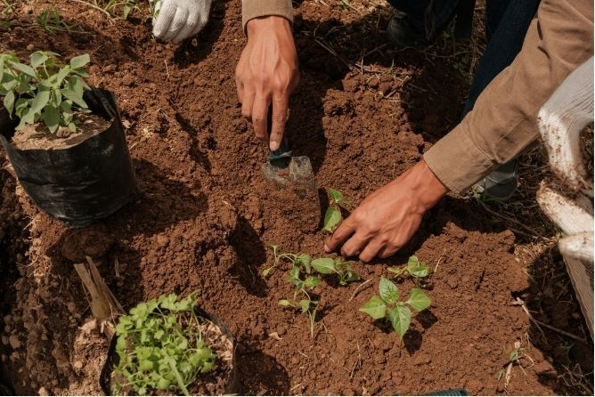
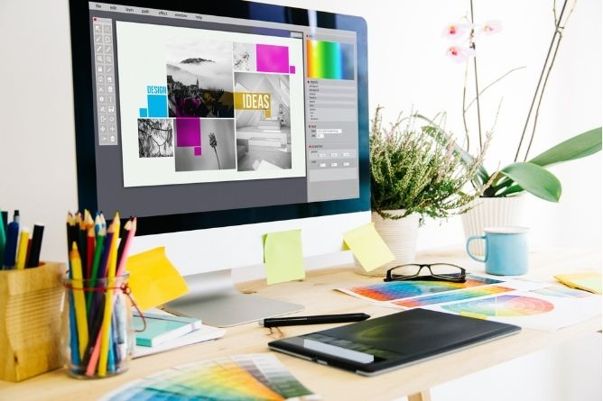

# MDEF Projects

Welcome to my journey through the **Master in Design for Emergent Futures (MDEF)**, a program by [Fab Lab Barcelona](https://mdef.fablabbcn.org/) and IAAC.  
This space documents the ideas, experiments, and reflections that shaped my learning process — from early prototypes to collective explorations.

---

## My Projects

-   **Initial Ideas**  
      
    Early explorations that became the foundation of future projects.  
    [Read more](project/project.md){ .md-button }

-   **Bootcamp**  
      
    Hands-on learning, rapid prototyping, and collaboration.  
    [Read more](term1/01-Bootcamp.md){ .md-button }

-   **Atlas of Weak Signals**  
      
    Researching emerging signals and future-oriented thinking.  
    [Read more](term1/02-Atlas of Weak Signals.md){ .md-button }

-   **Digi**  
      
    Digital tools and interactive systems.  
    [Read more](term1/01-Bootcamp.md){ .md-button }

-   **Studio**  
      
    Design, experimentation, and material explorations.  
    [Read more](term1/01-Bootcamp.md){ .md-button }

---

*Last update: {{ git_revision_date_localized }}*