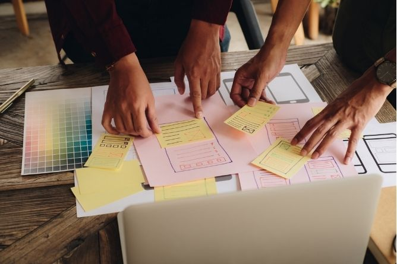

# MDEF Portfolio

Bienvenida a la sección de proyectos del **MDEF Portfolio**.  
Aquí podrás explorar las diferentes etapas, ideas y prototipos desarrollados a lo largo del programa.

---

- :material-lightbulb-on: __[Initial Ideas](project/project.md)__  
  
   Exploraciones iniciales que sentaron las bases de los proyectos.

- :material-rocket-launch: __[Bootcamp](term1/01-Bootcamp.md)__  
  
   Aprendizaje intensivo, prototipado rápido y colaboración.

- :material-map-search: __[Atlas of Weak Signals](term1/02-Atlas of Weak Signals.md)__  
  
   Investigación sobre tendencias emergentes y contextos futuros.

- :material-memory: __[Digi](term1/01-Bootcamp.md)__  
  
   Exploración digital y herramientas interactivas.

- :material-palette: __[Studio](term1/01-Bootcamp.md)__  
  
   Diseño, creación y materialización de ideas.

---

*Last update: {{ git_revision_date_localized }}*
